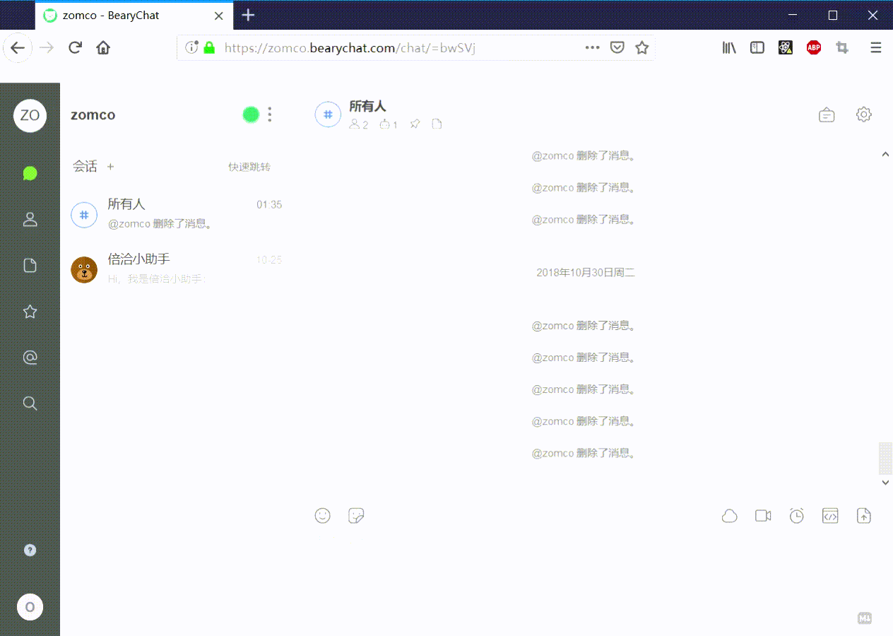

# hubot-speaker

一个在bearychat[https://bearychat.com]使用的发送和回复匿名消息的机器人，基于[hubot](https://hubot.github.com/)开发。

## 搭建

参考 [hubot-bearychat](https://github.com/bearyinnovative/hubot-bearychat):

    $ export HUBOT_BEARYCHAT_TOKENS=token-token-token-here
    $ export HUBOT_BEARYCHAT_MODE=rtm
    $ ./bin/hubot -a bearychat

## 场景

* channel: 带有机器人管理的群聊
* session channel: 没有机器人管理的群聊
* p2p: 私聊

### 回复匿名消息

| 消息类型 | 回复 Channel | 回复 Session | 回复 P2P     |
| ------- | ----------- | ----------- | -----------  |
| 文本    | 完成         | 完成         | 不支持        | 
| 图片    | 完成         | 完成         | 不支持        |

### 发送匿名消息

| 消息类型 | 回复 Channel | 回复 Session | 回复 P2P     |
| ------- | ----------- | ----------- | -----------  |
| 文本    | 完成         | 不支持       | 不支持        | 
| 图片    | 完成         | 不支持       | 不支持        |

## LICENSE

MIT